# 🎓 UdeC Alumni Mailing Service REST API

<div align="center">


**Secure Backend for Alumni Management and Mass Mailing Operations**

A robust, token-authenticated platform for managing alumni records, handling subscription status updates, and facilitating filtered mass email communication.

[Features](#-key-features) • [Installation](#%EF%B8%8F-installation) • [API Documentation](#-api-documentation) • [Security](#-security)

</div>

---

## ✨ Key Features

- 🔐 **JWT Authentication** - Secure token-based access control with role-based permissions
- 👥 **Alumni Management** - Complete CRUD operations for alumni records
- 📧 **Mass Mailing** - Filtered email campaigns with subscription management
- 🛡️ **Role-Based Access** - Admin and user-level authorization layers
- ☁️ **Cloud Database** - MongoDB Atlas integration for scalable data persistence
- 📊 **Subscription Tracking** - Opt-in/opt-out management system

---

## 🏗️ Technology Stack

| Component          | Technology              | Description                                       |
| ------------------ | ----------------------- | ------------------------------------------------- |
| **Runtime**        | Node.js                 | High-performance JavaScript runtime environment   |
| **Framework**      | Express.js              | Fast, unopinionated web framework for API logic   |
| **Database**       | MongoDB Atlas           | Cloud-hosted NoSQL database with flexible schemas |
| **Authentication** | JWT                     | Stateless token generation and validation         |
| **Email Service**  | Nodemailer + Gmail SMTP | Reliable mail transport with secure credentials   |
| **Dev Tools**      | Nodemon                 | Auto-restart server on file changes               |

---

## 🛠️ Installation

### Prerequisites

Ensure you have the following installed:

- **Node.js** v18 or higher ([Download](https://nodejs.org/))
- **npm** or **yarn** package manager
- **Insomnia** or **Postman** for API testing

### 1. Clone the Repository

```bash
git clone <YOUR_REPOSITORY_URL>
cd udec-alumni-service
```

### 2. Install Dependencies

```bash
npm install
```

### 3. Configure Environment Variables

Create a `.env` file in the project root with the following configuration:

> ⚠️ **SECURITY WARNING**: The `.env` file contains sensitive credentials. Never commit this file to version control.

```env
# --- Database Configuration ---
MONGODB_URI=your_uri

# --- Authentication Configuration ---
JWT_SECRET=your_super__duper_secret_key

# --- Email Configuration ---
EMAIL_HOST=your_host
EMAIL_PORT=587
EMAIL_USER=yourmail@gmail.com
EMAIL_PASS=xxxxxxxxxxxxxxxxxxxxxx
EMAIL_FROM="UdeC Alumni Service" <yourmail@gmail.com>
```

#### Environment Variables Reference

| Variable      | Description                             | Security Level                               |
| ------------- | --------------------------------------- | -------------------------------------------- |
| `MONGODB_URI` | MongoDB Atlas connection string         | 🔴 **CRITICAL** - Contains database password |
| `JWT_SECRET`  | Secret key for JWT signing/verification | 🔴 **CRITICAL** - Must be long and random    |
| `EMAIL_PASS`  | 16-character Gmail App Password         | 🔴 **CRITICAL** - Not your regular password  |
| `EMAIL_USER`  | Gmail address for sending emails        | 🟡 **MODERATE**                              |
| `EMAIL_HOST`  | SMTP server hostname                    | 🟢 **PUBLIC**                                |
| `EMAIL_PORT`  | SMTP server port                        | 🟢 **PUBLIC**                                |

### 4. Start the Development Server

```bash
npm run dev
```

**Expected Console Output:**

```
✅ MongoDB connection successful.
✅ Nodemailer transporter ready to send emails.
🚀 Server running on http://localhost:3000
```

---

## 📡 API Documentation

### Base URL

**Local Development:**

```
http://localhost:3000/api
```

### Authentication Endpoints

#### Register New Alumnus

```http
POST /auth/register
```

**Access:** Public  
**Description:** Creates a new alumni account with standard user privileges.

**Request Body:**

```json
{
  "email": "alumni@example.com",
  "password": "securePassword123",
  "firstName": "John",
  "lastName": "Doe",
  "graduationYear": 2020
}
```

#### Login

```http
POST /auth/login
```

**Access:** Public  
**Description:** Authenticates user and returns JWT access token.

**Request Body:**

```json
{
  "email": "alumni@example.com",
  "password": "securePassword123"
}
```

**Response:**

```json
{
  "token": "eyJhbGciOiJIUzI1NiIsInR5cCI6IkpXVCJ9...",
  "user": {
    "id": "507f1f77bcf86cd799439011",
    "email": "alumni@example.com",
    "isAdmin": false
  }
}
```

---

### Alumni Endpoints

#### Get Profile

```http
GET /alumni/profile
```

**Access:** 🔒 Authenticated Users  
**Middleware:** `verifyToken`  
**Headers:** `Authorization: Bearer <JWT_TOKEN>`

#### Update Subscription Status

```http
PUT /alumni/subscribe
```

**Access:** 🔒 Authenticated Users  
**Middleware:** `verifyToken`  
**Headers:** `Authorization: Bearer <JWT_TOKEN>`

**Request Body:**

```json
{
  "subscribed": true
}
```

---

### Mailing Endpoints

#### Get Subscribers List

```http
GET /mailing/subscribers
```

**Access:** 🔒 Admin Only  
**Middleware:** `verifyAdmin`  
**Headers:** `Authorization: Bearer <ADMIN_JWT_TOKEN>`

**Query Parameters:**

- `graduationYear` (optional): Filter by graduation year
- `subscribed` (optional): Filter by subscription status

#### Send Mass Email

```http
POST /mailing/send
```

**Access:** 🔒 Admin Only  
**Middleware:** `verifyAdmin`  
**Headers:** `Authorization: Bearer <ADMIN_JWT_TOKEN>`

**Request Body:**

```json
{
  "subject": "UdeC Alumni Newsletter - November 2025",
  "htmlContent": "<h1>Welcome Alumni!</h1><p>Message content here...</p>",
  "filters": {
    "graduationYear": 2020,
    "subscribed": true
  }
}
```

---

## 🛡️ Security

### Authentication Flow

```mermaid
graph LR
    A[Client Request] --> B{Has Token?}
    B -->|No| C[403 Access Denied]
    B -->|Yes| D{Valid Token?}
    D -->|No| E[401 Unauthorized]
    D -->|Yes| F{Admin Route?}
    F -->|Yes| G{Is Admin?}
    F -->|No| H[✅ Access Granted]
    G -->|No| I[403 Forbidden]
    G -->|Yes| H
```



### Middleware Protection Layers

| Middleware    | Purpose                              | Applied To           |
| ------------- | ------------------------------------ | -------------------- |
| `verifyToken` | Validates JWT presence and integrity | All protected routes |
| `verifyAdmin` | Checks for admin role in JWT payload | Admin-only routes    |

---
